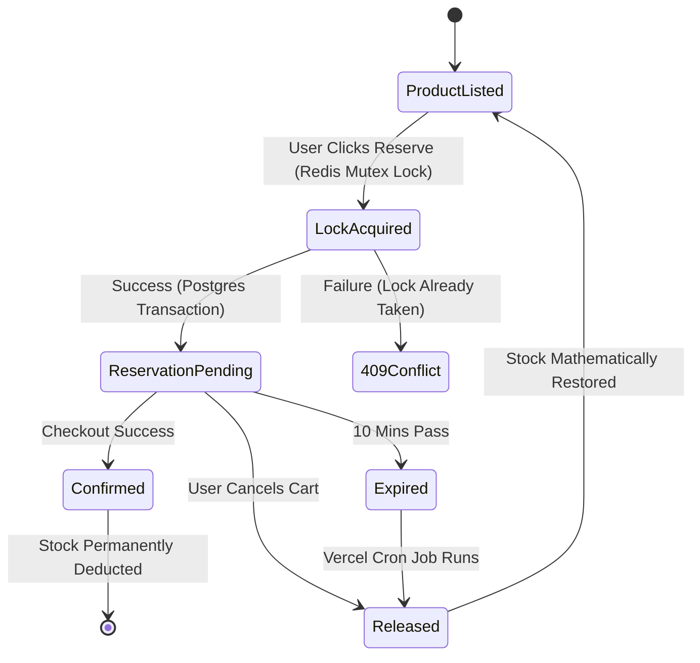

# Allo Pharmacy | Concurrency-Safe Inventory System

**Author:** Keerthi Kumar S, 22MIS0080

## 1. Project Overview

I built this high-performance, concurrency-safe medical inventory reservation system for Allo Health. My primary goal was to solve the critical e-commerce problem of **"overselling."** I designed the system to ensure that when multiple clinics or users attempt to reserve the exact same limited medical supplies simultaneously, my architecture enforces strict mathematical correctness and never allows the stock to drop below zero.

## 2. Architecture

At a high level, I designed a **Dual-Database Coordination Architecture**:

- **Frontend:** Next.js 15 (App Router) + Tailwind CSS + Shadcn UI.
- **Database (Source of Truth):** I utilized PostgreSQL (via Neon) to handle ACID-compliant relational data, storing the definitive state of the inventory and reservations.
- **Coordination (Locking & Caching):** I integrated Upstash Redis as a high-speed distributed coordination layer. It handles my distributed mutex locks to prevent race conditions and caches idempotency keys.

### System Data Flow



## 3. Setup Instructions

### Prerequisites

- Node.js 18+
- A PostgreSQL database (e.g., Neon)
- A Redis instance (e.g., Upstash)

### Local Setup

1. **Clone the repository:**
   ```bash
   git clone https://github.com/KeerthiKumar2902/Allo-Inventory-reservation-system.git
   cd Allo-Inventory-reservation-system
   ```
2. **Install dependencies:**
   ```bash
   npm install
   ```
3. **Environment Variables:**
   Copy the `.env.example` file to `.env` and fill in your database credentials:
   ```bash
   cp .env.example .env
   ```
4. **Database Migration & Seeding:**
   Push my schema to your database and seed it with the medical inventory:
   ```bash
   npx prisma db push
   node prisma/seed.js
   ```
5. **Run the Application:**
   ```bash
   npm run dev
   ```

## 4. Database & Schema Design

I designed the core schema around a strict separation of concerns for inventory mathematics:

- **`Product` & `Warehouse`**: These are my core domain models defining what exists and where it is located.
- **`Inventory`**: Instead of relying on a simple `stock` integer, my schema tracks `totalStock` and `reservedStock`. I dynamically derive `availableStock` (`total - reserved`). This architecture ensures I always know exactly how much inventory physically exists in the warehouse versus how much is temporarily locked in users' carts.
- **`Reservation`**: This table tracks the lifecycle of a user's checkout session. I implemented support for `PENDING`, `CONFIRMED`, and `RELEASED` states, along with an `expiresAt` timestamp for automatic cleanup.

## 5. Concurrency Strategy

Handling concurrent requests was the most critical engineering challenge I tackled in this system. I recognized that a naive approach (checking stock in memory and then updating the database) fails catastrophically under load. It leads to race conditions where multiple users might successfully reserve the last remaining item.

**My Solution:**

1. **Redis Mutex Locking**: Before my API even touches the PostgreSQL database, it acquires a distributed lock in Redis (`lock:inventory:{productId}:{warehouseId}`). If 10 requests hit my server at the exact same millisecond, Redis serialization ensures only 1 request secures the lock. The other 9 instantly receive a `409 Conflict`.
2. **PostgreSQL `FOR UPDATE`**: Inside the Prisma transaction, my system executes a raw SQL `SELECT ... FOR UPDATE`. This intentionally invokes row-level database locking. Even if the Redis lock is hypothetically bypassed, Postgres fundamentally prevents any other transaction from reading or modifying that specific inventory row until my current transaction securely commits.
3. **Atomic Math**: I utilized atomic increments and decrements (`increment: quantity`) rather than reading a value into memory and saving it back, ensuring absolute mathematical precision.

## 6. Expiry Strategy

I configured reservations to only be valid for 10 minutes.

- **The Problem:** I could not rely on the client's browser to tell my server when a reservation expires, because the user might simply close their tab.
- **My Solution:** I engineered a serverless Cron Job (`GET /api/cron/expire-reservations`) configured via `vercel.json` to execute every 5 minutes and scrub abandoned carts from the database.
- **Security:** I protected the cron route with a strict `CRON_SECRET` authorization header.
- **Tradeoffs Considered:** A polling cron job means an abandoned reservation might technically be held for up to 14 minutes (if it expires right after the 5-minute cron cycle finishes). I am aware that a more complex, enterprise-grade architecture would use a Queue Worker (like AWS SQS or Redis BullMQ) to schedule an exact delayed job. However, given Vercel's serverless constraints, my Cron approach proved to be the most pragmatic and highly stable solution.

## 7. Idempotency Implementation

To make my APIs truly production-ready and resilient, I implemented **Idempotency** for the Reserve and Confirm routes.

- **Why it matters:** If a user is on a train with a flaky 4G connection, their phone might automatically retry the `POST /confirm` request multiple times. Without idempotency, my backend could accidentally deduct the stock multiple times.
- **My Strategy:** I designed the frontend to generate a `crypto.randomUUID()` and send it within the `Idempotency-Key` HTTP header. My backend middleware intercepts this, hashes the request payload, and checks my Redis cache. If I have seen this exact key before, I instantly return the cached `200 OK` response without executing any redundant database logic. This state safely resides in Redis for 15 minutes.

## 8. Future Improvements

- **Redis Locking Scope:** Currently, my Redis lock specifically targets the product at a specific warehouse. While highly performant, I could improve the spin-lock mechanism to intelligently retry for a few milliseconds before failing, rather than instantly returning a 409 error to the user.
- **Queue Workers vs. Cron:** As mentioned in my Expiry Strategy, if I were to scale this to a massive enterprise system, I would pivot to an event-driven architecture (using Kafka or RabbitMQ) to handle expirations down to the exact millisecond, rather than relying on a polling cron job.
- **Authentication:** For this specific demo, I utilized `localStorage` for cart persistence. A full production rollout would require integrating NextAuth.js or Clerk to securely tie reservations to a rigid `UserId` schema.
- **Monitoring & Observability:** Integrating Datadog or Sentry would be my immediate next step. I would monitor the `409 Conflict` rates to precisely understand how frequently users are competing over the exact same medical inventory.
